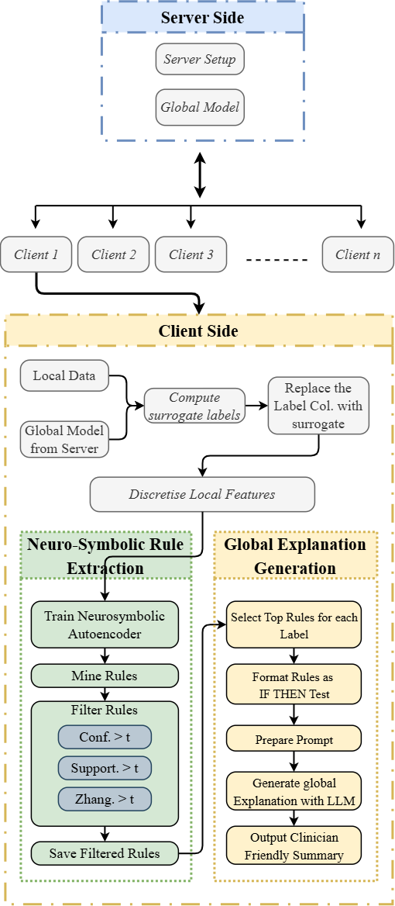

# FedNeuroXAI

Code, data and raw results for the paper

> **Neuro-Symbolic Rule Mining at the Edge: Per-Client Explanation for Federated Clinical Models**
> Zia Ur Rehman, Douglas Mota Dias, Saif Ul Islam, Conor Ryan.
> *Proceedings of the 16th International Conference on the Internet of Things (IoT 2026)*, ACM, Newcastle upon Tyne, UK.

In federated learning, clinical sites train one shared model without pooling
patient records, so no site can explain that model with anyone else's data.
FedNeuroXAI lets every client explain the shared global model using only its
own local data:

1. **Surrogate labelling.** The client labels its local records with the
   global model's own predictions.
2. **Neuro-symbolic rule mining.** It discretises the data and mines
   IF-THEN rules with the PyAerial autoencoder.
3. **Per-prediction justification.** Each prediction is explained by the
   highest-confidence rule that fires, and compared with SHAP and LIME.
4. **LLM narrative.** A locally hosted LLM (Llama-3.2-3B-Instruct) turns the
   rule set into a plain-language summary for clinicians.

All four steps run on the client. Only model parameters or aggregate
statistics cross the network.

---

## Contents

- [Repository structure](#repository-structure)
- [Federated architecture: client and server](#federated-architecture-client-and-server)
- [Installation](#installation)
- [Quick start](#quick-start)
- [Reproducing the paper](#reproducing-the-paper)
- [Reproducibility notes](#reproducibility-notes)
- [Configuration](#configuration)
- [Citation](#citation)
- [License and acknowledgements](#license-and-acknowledgements)

---

## Repository structure

```
FedNeuroXAI/
├── README.md
├── LICENSE                     MIT (code only; see data/README.md for data)
├── CITATION.cff
├── requirements.txt            core dependencies (pinned)
├── requirements-llm.txt        optional: LLM narrative layer
│
├── fedneuroxai/                the method, as a Python package
│   ├── config.py               paths, datasets, all experimental settings
│   ├── data.py                 CSV loading and feature-name sanitising
│   ├── partition.py            simulated federation: non-IID (Dirichlet) / IID splits
│   ├── client.py               CLIENT side: local training, local statistics,
│   │                           discretisation, surrogate labels, rule mining
│   ├── server.py               SERVER side: shared scaler, FedAvg, exact
│   │                           sufficient-statistic aggregation (NB, LDA)
│   ├── rules.py                PyAerial rule mining and rule-set metrics
│   ├── instance_explain.py     fired rule vs SHAP vs LIME for one prediction
│   ├── narrative.py            LLM prompt, generation, threshold-faithfulness check
│   └── experiment.py           one end-to-end run (split -> train -> explain)
│
├── scripts/                    one script per experiment in the paper
│   ├── smoke_test.py           1-minute installation check
│   ├── run_experiments.py      main 4x5 matrix, non-IID and IID
│   ├── run_seeds.py            seed robustness
│   ├── run_centralized.py      centralised upper bound
│   ├── run_scaling.py          client-count scaling (C = 5, 10, 20)
│   ├── run_narratives.py       LLM narrative faithfulness   (needs the LLM)
│   ├── profile_footprint.py    time / memory / disk on one client
│   ├── make_tables.py          rebuild all result tables from JSON
│   ├── make_figures.py         Figure 4
│   └── make_shap_lime_table.py Table 6
│
├── data/                       the four datasets (+ sources and licences)
├── results/                    the paper's raw results (JSON), see below
└── figures/                    generated figures
```

### What the shipped `results/` contain

These are the exact outputs behind the numbers in the paper, so every table
can be rebuilt **without running any experiment**.

| Path | Content |
|---|---|
| `results/noniid/<dataset>/<model>.json` | main runs, Dirichlet α = 0.5, C = 5 |
| `results/iid/<dataset>/<model>.json` | same, IID partition |
| `results/seeds/seed{42..46}/...` | non-IID matrix under five seeds |
| `results/centralized.json` | single-client (centralised) upper bound |
| `results/scaling.json` | Heart Disease with C = 5, 10, 20 |
| `results/narrative_faithfulness.json` | 20 LLM narratives and threshold checks |
| `results/footprint.json` | resource profile of one client |
| `results/shap_lime_table.json` | Table 6 data |
| `results/tables.md` | all tables, as generated by `make_tables.py` |

Each per-run JSON records the global accuracy/F1 and, for every client, its
split sizes, number of rules, all rule-set metrics, and each explained
instance's fired rule, SHAP ranking, LIME ranking (or the error LIME/SHAP
raised) and overlap scores.

---

## Federated architecture: client and server

<p align="center">
  
</p>
<p align="center"><em>Figure 1 of the paper: the server distributes the global model; every client runs the whole explanation pipeline on its own local data.</em></p>

The experiments simulate the federation in one process, but the code is split
by where each step would run in a real deployment:

```
          ┌────────────────────────── SERVER (server.py) ──────────────────────────┐
          │  aggregate_scaler      combine client (n, mean, var) -> shared scaler   │
          │  fedavg_train          sample-weighted average of client weights (Eq. 2)│
          │  aggregate_gaussian_nb / aggregate_lda                                  │
          │                        exact pooling of per-class statistics (Eq. 3-4)  │
          └───────────────▲──────────────────────────────────────┬──────────────────┘
       weights or aggregate statistics only           global model h_g
                          │                                      ▼
┌──────────────────────── CLIENT j (client.py), one per hospital / edge node ───────────────────────┐
│ Federation:   local_feature_stats · local_update (1 SGD epoch / round) · local_gaussian_nb /     │
│               local_lda_stats                                                                     │
│ Explanation:  discretize_client -> surrogate labels h_g(X_j) -> PyAerial rules -> fidelity         │
│               (explain_client) · fired rule vs SHAP/LIME (instance_explain) · LLM (narrative)     │
│ Rules, narratives and explanations never leave the client.                                        │
└───────────────────────────────────────────────────────────────────────────────────────────────────┘
```

| Classifier | Federation | Rounds |
|---|---|---|
| Logistic regression (`SGDClassifier`, log loss) | FedAvg | 100 |
| Linear SVM (`SGDClassifier`, modified Huber, so LIME gets probabilities) | FedAvg | 100 |
| MLP (one hidden layer, 32 units) | FedAvg, per layer | 100 |
| Gaussian Naive Bayes | exact sufficient-statistic aggregation | one shot |
| Linear Discriminant Analysis | exact sufficient-statistic aggregation | one shot |

To deploy the method on real separate machines, keep `client.py` on each node
and `server.py` on the coordinator, and replace the in-process loop in
`server.federated_train` with your communication layer (e.g. Flower or gRPC).
No other part of the pipeline needs to change.

---

## Installation

Tested with **Python 3.11** on Windows 11 and CPU only (no GPU needed).

```bash
git clone https://github.com/<your-account>/FedNeuroXAI.git
cd FedNeuroXAI

python -m venv .venv
# Windows:      .venv\Scripts\activate
# Linux/macOS:  source .venv/bin/activate

pip install -r requirements.txt
```

### Optional: the LLM narrative layer

Needed only for `run_narratives.py` and the LLM part of `profile_footprint.py`.

```bash
pip install -r requirements-llm.txt
```

The paper uses **[meta-llama/Llama-3.2-3B-Instruct](https://huggingface.co/meta-llama/Llama-3.2-3B-Instruct)**,
a gated model. Accept its licence on Hugging Face, then either log in
(`huggingface-cli login`) and let the scripts download it, or download it
once and point to the local folder:

```bash
huggingface-cli download meta-llama/Llama-3.2-3B-Instruct --local-dir models/Llama-3.2-3B-Instruct
export FEDNEUROXAI_LLM=models/Llama-3.2-3B-Instruct      # Windows: set FEDNEUROXAI_LLM=...
```

The LLM runs at fp32 on CPU with greedy decoding: about **13 GB RAM** and
4-5 minutes per narrative on a laptop CPU.

---

## Quick start

All commands are run from the repository root.

```bash
# 1. Check the installation (~1 minute). Confirms that the deterministic
#    part of the pipeline reproduces the paper exactly.
python scripts/smoke_test.py

# 2. Rebuild every result table from the shipped raw results (seconds).
python scripts/make_tables.py

# 3. Rebuild Figure 4 from the shipped raw results.
python scripts/make_figures.py
```

---

## Reproducing the paper

New runs are written to `results_rerun/` by default, so the shipped results
in `results/` are never overwritten. Point the table and figure scripts at
your reruns with `--results results_rerun`.

| Paper | What | Command | Rough time (laptop CPU) |
|---|---|---|---|
| Tables 3, 4, 9; Fig. 4 | main matrix, non-IID + IID | `python scripts/run_experiments.py` | 30-60 min |
| Table 5 | centralised upper bound | `python scripts/run_centralized.py` | ~5 min |
| Table 6 | SHAP / LIME vs rule usage | `python scripts/make_shap_lime_table.py --results results_rerun` | ~2 min |
| Table 7 | seed robustness (seeds 42-46) | `python scripts/run_seeds.py` | 30-60 min |
| Table 8 | LLM narrative faithfulness | `python scripts/run_narratives.py` | ~1.5 h (LLM) |
| Table 10(b) | resource footprint | `python scripts/profile_footprint.py` (or `--no-llm`) | ~5 min |
| Table 10(c) | client-count scaling | `python scripts/run_scaling.py` | ~10 min |

Then:

```bash
python scripts/make_tables.py  --results results_rerun
python scripts/make_figures.py --results results_rerun --out figures_rerun
```

Every run script accepts `--datasets`, `--models`, `--seed` and `--out`, for
example:

```bash
python scripts/run_experiments.py --partition dirichlet --datasets heart --models lda
```

Some combinations fail on degenerate shards (for example a non-IID client
receiving a single row, which LDA cannot fit). These are logged
(`results_rerun/run_experiments_log.json`, `results_rerun/seeds/run_seeds_log.json`,
`results_rerun/scaling.json`) and skipped, exactly as in the paper
(Fetal HR at seed 46 and Heart LDA at two seeds in Table 7; Heart LDA at
C = 20 in Table 10(c)).

---

## Reproducibility notes

What will and will not match the paper when you rerun:

| Quantity | Reproduces exactly? | Why |
|---|---|---|
| client partitions and split sizes | **yes** | seeded NumPy / scikit-learn |
| global accuracy and F1 (Tables 3, 5, 7, 9, 10(c)) | **yes** | deterministic training given the seed |
| SHAP for linear models (LR, SVM, LDA) | **yes** | exact `LinearExplainer` |
| LIME rankings | close | LIME samples a random neighbourhood around each instance |
| number of rules, fidelity, coverage, rule metrics | **close, not identical** | see below |
| SHAP for MLP / Naive Bayes | close | permutation explainer is sampling-based |
| timings and memory (Table 10(b), 10(c)) | no | hardware dependent |
| LLM narratives | yes given identical rules | greedy decoding; but rules vary (see below) |

**Rule mining.** PyAerial initialises its autoencoder with PyTorch, and the
runs reported in the paper did not seed PyTorch, so rule mining varied
slightly from run to run (the paper's seed analysis, Table 7, quantifies the
resulting spread of fidelity). The scripts in this repository now call
`set_seed()` (Python, NumPy and PyTorch) before every run, so **your reruns
are repeatable on a given machine**, but individual rule counts and
fidelities will not match the shipped JSON digit for digit. The shipped
`results/` are the exact numbers in the paper.

How large is this variation? It depends strongly on shard size:

- **Single small client: large.** For the worked-example client (WBC,
  client 0, IID, Naive Bayes, 56 training rows), changing only the PyTorch
  seed gave between 410 and 1,677 rules and a fidelity between 0.54 and
  0.88 across six seeds. The rule-extraction time in Table 10(b) scales with
  the number of rules mined, so it varies too.
- **Averages: small.** Means over clients and classifiers are far more
  stable. An independent rerun of the C = 5 Heart Disease configuration
  reproduced the paper's mean fidelity within 0.01 (non-IID 0.665 vs 0.672;
  IID 0.854 vs 0.862), and Table 7 quantifies the spread across seeds.

Compare reruns with the paper at the level of these means, not individual
clients.

**How the tables aggregate.** Fidelity, coverage and rule-quality metrics
are averaged over *usable* clients, i.e. clients whose shard was large and
balanced enough to receive a local test split (Section 3.1); rule counts are
averaged over all clients; dataset-level numbers (Tables 5, 7, 9) average the
five classifiers; Table 7 reports the population standard deviation across
seeds. `scripts/make_tables.py` implements exactly this.

**Environment used for the paper.** Python 3.11.4, Windows 11, Intel Core
Ultra 5 235U (12 cores, 14 threads), 32 GB RAM, no GPU, with the package
versions pinned in `requirements.txt` / `requirements-llm.txt`.

---

## Configuration

All settings live in `fedneuroxai/config.py`:

| Setting | Value | Paper |
|---|---|---|
| clients `N_CLIENTS` | 5 | Section 4 |
| Dirichlet `DIRICHLET_ALPHA` | 0.5 | Eq. 1 |
| FedAvg rounds `N_ROUNDS` | 100 | Section 3.2 |
| central hold-out / client test split | 30% / 30% | Section 4 |
| rule thresholds (support, confidence, Zhang) | 0.03, 0.60, 0.05 | Section 4 |
| bins B / autoencoder epochs e | Diabetes 4/15, WBC 3/15, Heart 4/10, Fetal HR 4/20 | Section 4 |
| instances explained per client | 3 | Section 4 |
| top-k for Jaccard overlap | 3 | Eq. 9 |
| top rules per class sent to the LLM (κ) | 6 | Section 3.5 |
| seed | 42 | |

To use your own dataset, add an entry to `config.DATASETS` (CSV file, target
column, bins, epochs) and place the CSV in `data/`.

---

## Citation

If you use this code, please cite:

```bibtex
@inproceedings{rehman2026neurosymbolic,
  author    = {Rehman, Zia Ur and Mota Dias, Douglas and Islam, Saif Ul and Ryan, Conor},
  title     = {Neuro-Symbolic Rule Mining at the Edge: Per-Client Explanation for Federated Clinical Models},
  booktitle = {Proceedings of the 16th International Conference on the Internet of Things (IoT 2026)},
  year      = {2026},
  publisher = {ACM},
  address   = {Newcastle upon Tyne, United Kingdom}
}
```

Please also cite PyAerial (Karabulut, Groth and Degeler, *Neurosymbolic
Association Rule Mining from Tabular Data*, NeSy 2025) and the dataset
sources listed in `data/README.md`.

---

## License and acknowledgements

Code: MIT licence (see `LICENSE`). Datasets: see `data/README.md`.
The Llama 3.2 model is subject to Meta's Llama 3.2 Community License.

This research is supported in part by the Federated Offline Reflection
Grammatical Evolution (FORGE) project funded by Research Ireland.

Contact: Zia Ur Rehman, University of Limerick (https://bds.ul.ie/members/zia-ur-rehman.html).
